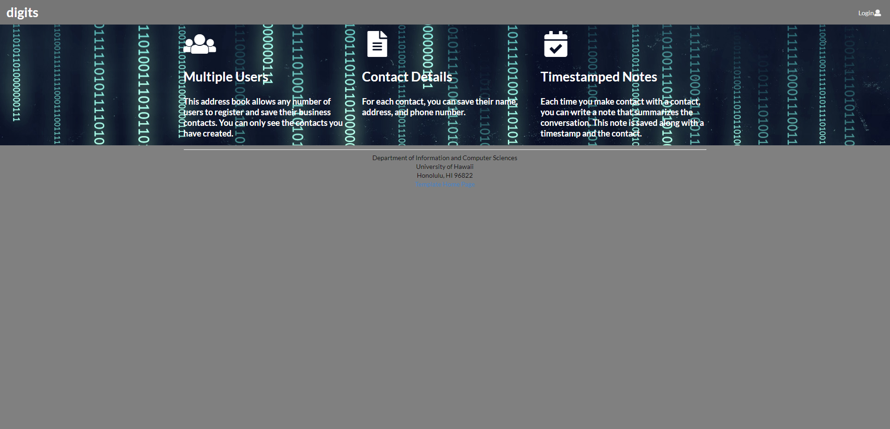
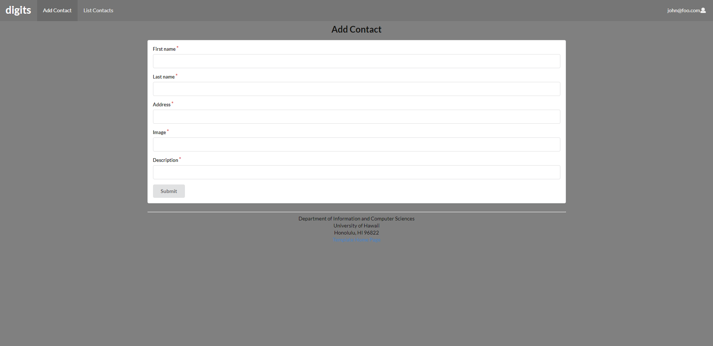

This web page is a contact collection application that allows you to add and edit contacts, and add timestamped notes to each contact.

## Installation

```
$ meteor npm install
```

## Running the Application

```
$ meteor npm run start
```

## Adding a Contact

The add contact page allows you to add contact once logged into your account.
You can add an Address, Image, and a Description of your contact.

## Listing Contacts

The list contact page lists your added contacts and allows you to add a timestamped note to each contact.

